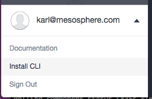

# DC/OS 102 - CLI

The DC/OS CLI is the primary programmatic control interface for observing and managing your cluster.

## Install

Follow the platform-specific instructions in the UI for installing and configuring the CLI.



Use the Linux instructions if you're using a Linux VM for your workspace.

**WARNING**: The Windows install instructions aren't designed for a bash shell. If you're using Docker for Windows with GitBash, it might be easier to install the DC/OS CLI in Powershell.

## Log in

```
$ dcos auth login
```

Follow instructions to generate an OAuth token in a browser and paste it into the CLI.

## Create service

Install MinitTwit as a new Service.

```
# create service definition
$ cat > minitwit.json << EOF
{
  "id": "/minitwit",
  "instances": 1,
  "cpus": 1,
  "mem": 512,
  "container": {
    "docker": {
      "image": "mhausenblas/minitwit",
      "forcePullImage": false,
      "privileged": false,
      "portMappings": [
        {
          "hostPort": 80,
          "containerPort": 80,
          "protocol": "tcp"
        }
      ],
      "network": "BRIDGE"
    }
  },
  "acceptedResourceRoles": [
    "slave_public"
  ],
  "requirePorts": true
}
EOF

# create service
dcos marathon app add < minitwit.json
```

## View services

```
$ dcos marathon app list
```

## Locate service endpoint

Because this service is mapping to port 80 on the host, we can use the host's IP.

```
$ dcos marathon app show minitwit | jq -r .tasks[0].host
```

## Destroy service

```
# stop the service (could be started again later)
$ dcos marathon app stop minitwit

# remove the service (delete record and logs)
$ dcos marathon app remove minitwit
```

